# Internet of Thinks (IoT)

## ¿Qué es IoT? 

Se le llama **Internet de las cosas**, en inglés **Internet of Things (IoT)** a la posibilidad de interconexión y transmisión de datos entre objetos cotidianos e internet.


Los aparatos electrónicos y los dispositivos digitales cotidianos tienen circuitos y sensores que les permite recolectar y compartir datos con la internet sin la intervención de personas. 

## ¿Cómo funciona el IoT?

Los **dispositivos IoT** se conectan con un proceso llamado M2M (machine to machine, o máquina a máquina) en el que dos dispositivos o máquinas cualesquiera se comunican entre sí utilizando cualquier tipo de conectividad (que puede ser cable, WiFi, Bluetooth, etc.), haciendo su trabajo sin la necesidad de que un humano intervenga. No deja de ser el mismo concepto que las conexiones Peer to Peer de los ordenadores para jugar online o compartir archivos.

Entonces nos encontramos que un dispositivo IoT recolecta, procesa y analiza una gran cantidad de información, entre la que se incluye información sobre los hábitos y preferencias de consumo de cada uno de los usuarios, así como por ejemplo poder gestionar su salud u otras utilidades para el día a día que no serían posibles si.  Como, por ejemplo, si hay algún fallo en tu coche, el ordenador a bordo del mismo puede enviar un aviso para que lo lleves al taller.

Un ejemplo de dispositivo IoT es el altavoz inteligente Amazon de Alexa, el cual se encuentra conectado a la red de redes para obtener información e interactúa con otros dispositivos para darnos la capacidad de controlarlos a través de simples comandos de voz. 

## Dispositivos IoT

Un dispositivo IoT consiste en un **objeto** al que se le ha dotado de conexión a Internet y cierta inteligencia software, sobre el que se pueden medir parámetros físicos (mediante **sensores**) o actuar remotamente (**actuadores**) y que por tanto permite generar un ecosistema de servicios alrededor del mismo. 

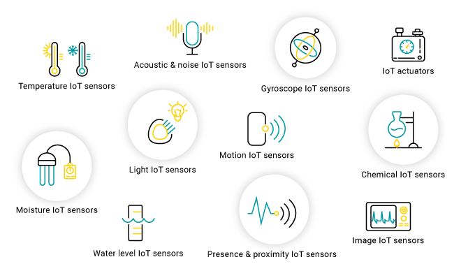

Para lograr que sensores y actuadores recolecten y envíen datos del mundo físico a Internet, los dispositivos IoT cuentan con un componente escencial:  el [microcontrolador](https://aprendiendoarduino.wordpress.com/2015/03/23/microcontroladores/). Los microcontroladores son **Sistemas Embebidos de Control** diseñados para realizar funciones dedicadas, normalmente en tiempo real. Al contrario de lo que ocurre con los ordenadores de propósito general, que están diseñados para cubrir un amplio rango de necesidades, los sistemas embebidos se diseñan para cubrir necesidades específicas y por tanto forman parte de multitud de productos en los que se requiere una cierta potencia de proceso como electrodomésticos, vehículos, máquinas, etc.

En el link [historia microprocesadores](historia_microcontroladores.pdf) se muestra una referencia detallada desde el comienzo de los microprocesadores hasta la aparición de los microcontroladores al mercado. Este material, diseñado por el ing. Hugo Pailos, permite comprender cómo la tecnología de los microcontroladores fue evolucionando hasta lo que conocemos en la actualidad.

## Ventajas del IoT

Algunas de las ventajas mas significativas del IoT:

- **Conectividad y Comunicación**: El IoT permite la conexión de dispositivos y sistemas en red, lo que facilita la comunicación y la transferencia de datos en tiempo real entre ellos.

- **Automatización y Eficiencia**: Los dispositivos IoT pueden recopilar datos, analizarlos y tomar decisiones automáticas, lo que lleva a una mayor eficiencia operativa y a la automatización de tareas.

- **Monitoreo Remoto**: El IoT permite el monitoreo y control remoto de dispositivos y sistemas, lo que facilita la supervisión y gestión de procesos desde cualquier ubicación.

- **Mejora de la Productividad**: Al automatizar tareas repetitivas y optimizar procesos, el IoT puede mejorar la productividad en diversas industrias y actividades.

- **Personalización y Experiencia del Usuario**: El IoT permite la personalización de servicios y experiencias para los usuarios, adaptándose a sus necesidades y preferencias individuales.

- **Toma de Decisiones Basada en Datos**: Los datos recopilados por los dispositivos IoT proporcionan información valiosa para tomar decisiones informadas, lo que lleva a una toma de decisiones más precisa y efectiva.


## Microcontroladores ARDUINO

**Arduino** es una plataforma de creación de electrónica de código abierto, la cual está basada en hardware y software libre, flexible y fácil de utilizar para los creadores y desarrolladores. Esta plataforma permite crear diferentes tipos de microordenadores de una sola placa a los que la comunidad de creadores puede darles diferentes tipos de uso.

Para poder entender este concepto, primero vas a tener que entender los conceptos de hardware libre y el software libre. El hardware libre son los dispositivos cuyas especificaciones y diagramas son de acceso público, de manera que cualquiera puede replicarlos. Esto quiere decir que Arduino ofrece las bases para que cualquier otra persona o empresa pueda crear sus propias placas, pudiendo ser diferentes entre ellas pero igualmente funcionales al partir de la misma base.


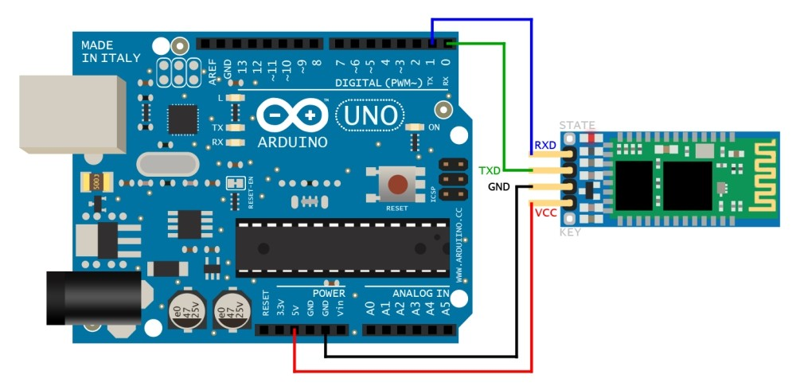

El **Arduino** es una placa basada en un microcontrolador ATMEL. Los microcontroladores son circuitos integrados en los que se pueden grabar instrucciones, las cuales las escribes con el lenguaje de programación que puedes utilizar en el entorno Arduino IDE. Estas instrucciones permiten crear programas que interactúan con los circuitos de la placa.

El microcontrolador de Arduino posee lo que se llama una interfaz de entrada, que es una conexión en la que podemos conectar en la placa diferentes tipos de periféricos. La información de estos periféricos que conectes se trasladará al microcontrolador, el cual se encargará de procesar los datos que le lleguen a través de ellos.

El tipo de periféricos que puedas utilizar para enviar datos al microcontrolador depende en gran medida de qué uso le estés pensando dar. Pueden ser cámaras para obtener imágenes, teclados para introducir datos, o diferentes tipos de sensores.

También cuenta con una interfaz de salida, que es la que se encarga de llevar la información que se ha procesado en el Arduino a otros periféricos. Estos periféricos pueden ser pantallas o altavoces en los que reproducir los datos procesados, pero también pueden ser otras placas o controladores.

## Placas Esp32

**ESP32** es una familia de microcontroladores de la empresa **Espressif Systems**. Su analogía más clara es la de un Arduino esteroides, que incluye Wifi, Bluetooth, altas velocidades de procesamiento, mayor capacidad de almacenamiento de datos, entre otras potentes características extra. 

ESP32 es un microcontrolador de bajo costo y bajo 
consumo de energía conocido bajo la categoría de *SoC* (System on Chip)


Para mayor información consultar la hoja de datos (datasheet) del fabricante aquí: https://www.electrosoftcloud.com/wp-content/uploads/2021/04/esp32-wroom-32_datasheet_en.pdf.


### Arquitectura del ESP32   

#### Tensión de trabajo

El voltaje de funcionamiento de los microprocesadores ESP es de **3,3 V** en comparación con el voltaje de funcionamiento de Arduino de **5 V**. Si las placas se utilizan mientras están conectadas a la toma de corriente, no habrá diferencia en el consumo de energía porque la corriente se reducirá para recolectar la misma cantidad de energía. En el caso de un caso de uso alimentado por batería, la diferencia será mucho mayor porque si la curva de descarga de la batería cae por debajo del voltaje de funcionamiento, el microprocesador se apagará.

Por lo tanto, las placas basadas en ESP tendrán un tiempo de ejecución más prolongado, ya que estas placas podrían funcionar a 4 V, mientras que a 4 V las placas Arduino se apagaron.


#### Memorias: FLASH, SRAM, ROM y EEPROM

- La memoria flash (espacio del programa), es donde se almacena el programa escrito en C/C++ (hasta 4MB). También almacena el firmware del Sistema Operativo (RTOS).
- SRAM (memoria estática de acceso aleatorio) es donde el boceto crea y manipula variables durante la ejecución (hasta 520k).
- EEPROM es el espacio de memoria que los programadores pueden usar para almacenar información a largo plazo.
La memoria flash y EEPROM no son volátiles (la información persiste después del apagado). SRAM es volátil y se perderá al encenderlo.
- ROM de 448 KB, para el bootloader del sistema operativo y otros códigos esenciales de sólo lectura.

#### Velocidad de reloj

Todas las placas Arduino funcionan a 16 MHz, lo que significa que el microprocesador puede ejecutar hasta 16 millones de instrucciones por segundo. Eso puede parecer mucho, pero si considera que simplemente configurar el pin digital en alto puede tomar más de 50 ciclos de reloj. Las tarjetas basadas en ESP son mucho más rápidas con una velocidad de reloj de 52 MHz a 240 MHz. La placa que se utilizará en la cátedra cuenta con un procesador *Tensilica Xtensa LX6 de doble núcleo de 32 bits de hasta 240 MHz*. 

#### Pines digitales de entrada y salida, PWM y analógicos

**Pines de E/S digitales**: la diferencia entre todas las placas cuando se trata de pines de E / S digitales es casi nula. La única diferencia es que las placas más grandes, como la NodeMCU ESP32 (36) y la placa más grande, la Arduino MEGA R3 (54) tiene muchos pines de E/S digitales.

Las entradas digitales o binarias de los microcontroladores tienen dos estados: **On / Off (true o false; HIGH o LOW)**. Un valor de tension alto (5v o 3.3v) equivale a un “1” lógico, mientras que uno bajo equivale a un “0”.
Se pueden conectar:
- pulsadores
- sensores discretos
- llaves / interruptores

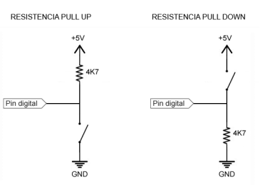

Así como las entradas digitales permiten sensar actividades que tienen dos estados, las salidas digitales permiten controlar actividades que tienen dos estados. Con las salidas digitales se puede encender o apagar el dispositivo que se conecte al pin.

Se pueden conectar:
- Leds
- Pantallas LCD
- Transistores
- Relés

**Pines PWM**: las placas basadas en ESP tienen una mejor relación de pines de E/S digitales a pines PWM es utilizado por un pin digital. Todos los pines que pueden utilizarse como salida soportan PWM excepto los pines del 34 al 39.

#### PWM
PWM son las siglas de **P**ulse **W**idth **M**odulation (Modulación por ancho de pulso). Para transmitir una señal, ya sea analógica o digital, se debe modular para que sea transmitida sin perder potencia o sufrir distorsión por interferencias.

**PWM** es una técnica que se usa para transmitir señales analógicas cuya señal portadora será digital. En esta técnica se modifica el ciclo de trabajo de una señal periódica (una senoidal o una cuadrada, por ejemplo), ya sea para transmitir información a través de un canal de comunicaciones o para controlar la cantidad de energía que se envía a una carga. El ciclo de trabajo (duty cycle) de una señal periódica es el ancho de su parte positiva, en relación con el período. Está expresado en porcentaje, por tanto, un duty cycle de 10% indica que está 10 de 100 a nivel alto.

> Duty cycle = t / T
>
> t = tiempo en parte positiva
>
>T = Periodo, tiempo total

Básicamente, consiste en activar una salida digital durante un tiempo y mantenerla apagada durante el resto, generando así pulsos positivos que se repiten de manera constante. Por tanto, la frecuencia es constante (es decir, el tiempo entre disparo de pulsos), mientras que se hace variar la anchura del pulso, el duty cycle. El promedio de esta tensión de salida, a lo largo del tiempo, será igual al valor analógico deseado.

La siguiente imagen muestra diferentes ciclos de trabajos para un rango de voltajes de 0 a 5v.

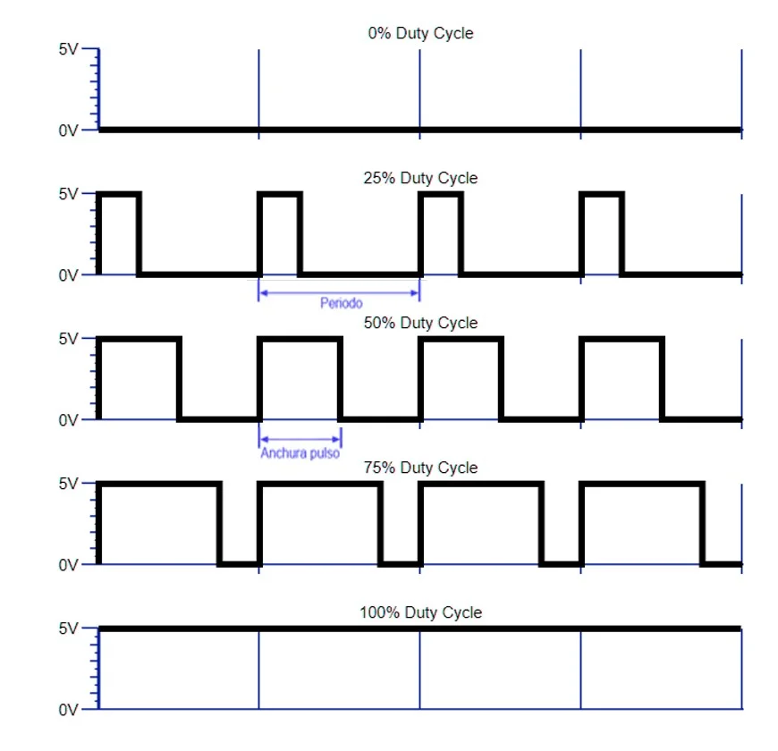

Por ejemplo, si con una tensión Vcc de 5V queremos una señal PWM de 1V, se generará una señal que el 20% del tiempo valdrá 5V y el 80% restante 0V.

Esta modulación es muy usada para controlar la cantidad de energía que se envía a una carga, es una técnica utilizada para regular la velocidad de giro de los motores, regulación de intensidad luminosa, controles de elementos termoeléctricos o controlar fuentes conmutadas entre otros usos.

La mayoría de los automatismos, incluido Arduino, no son capaces de proporcionar una señal analógica. Sólo pueden proporcionar una salida digital de -Vcc o Vcc. (por ejemplo, 0V y 5V). Entonces, para conseguir una señal analógica, la mayoría de los automatismos usan PWM. Se usa esta técnica porque como se ve en los ejemplos anteriores, no siempre quieres un valor digital de la señal (ON/OFF), si no que necesitaremos proporcionar un valor analógico de tensión que usarán para las aplicaciones deseadas.

Para comprender más sobre el uso de esta técnica se deja el siguiente [video](https://www.youtube.com/watch?v=ArvU6pEiQdA).


**Pines analógicos**: 
Una entrada analógica es una que le permite al microcontrolador leer un voltaje variable, típicamente desde los 0V hasta el voltaje de alimentación del microcontrolador.
Un puerto de entrada analógica convierte un valor de tension en un número entero.

La placa cuenta con 16 pines que soportan entradas analógicas que son mapeadas a valores de tensión de 0 - 3.3v mediante un conversor analógico-digital (ADC) con una resolución de 12 bits (es decir con valores de 0 a 2075).


Por ejemplo si queremos leer un valor de tensión variable desde un pin 34 utilizamos:

```c++
int valor = analogRead(34);
```
Podemos configurar la cantidad de bits utilizados mediante…

```c++
analogReadResolution(10);
```
Finalmente para leer un valor variable de voltaje:

```c++
float voltaje = (analogRead(34)/256)*3.3
```

En el camino inverso, la placa cuenta solo con dos pines que pueden utilizarse como salidas analógicas: GPIO25 y GPIO26 mediante un Conversor Digital Analógico (DAC) con una resolución de 8 bits (con valores de 0 a 255).

La siguiente imagen sintetiza la distribución de conectores de la placa.

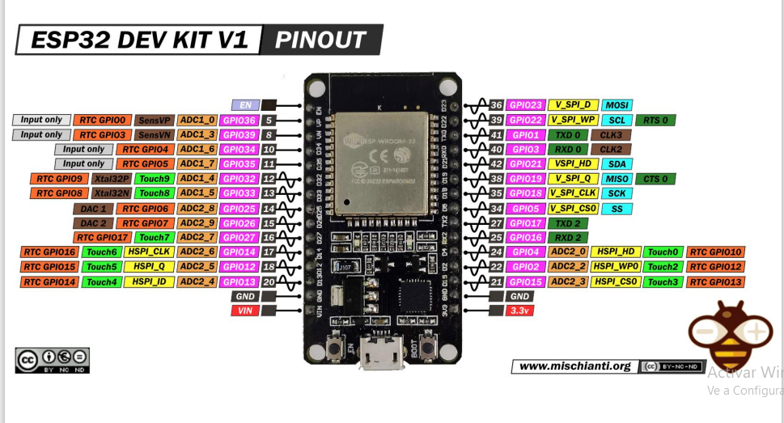

- Conector micro-USB para la alimentación y 
comunicación
- 30 ó 36 Conectores GPIO para entrada y salida de 
señales digitales
- 3 interfaces serie SPI (HW específico)
- 2 interfaces I2C (HW específico)
- 2 interfaces I2S
- 2 canales de conversor analógico a digital de 12 bits 
(ADC)
- 2 canales de conversor digital a analógico (DAC)
- 16 canales de salida PWM
- 3 interfaces UART
- 10 GPIO de detección capacitiva (Touch)
- Botones ENABLE y BOOT
- Conectividad Wi-Fi y Bluetooth
- LED integrado

#### Protocolos de comunicación

- **SPI** (Serial Peripheral Interface) para enviar datos entre microcontroladores. Es un bus de datos síncrono, es decir, utiliza un reloj para regular la transferencia de datos. 
- **I2C** más utilizado para enviar y recibir datos de otros dispositivos como pantallas OLED, sensores de presión barométrica, etc. 
- **I2S** (Inter-IC Sound), es un estándar de interfaz de bus serie eléctrico que se utiliza para conectar dispositivos de audio digital entre sí. 
- **UART** (Receptor / Transmisor Asíncrono Universal) no es un protocolo de comunicación como SPI e I2C, sino un circuito físico en un microcontrolador. El objetivo principal es transmitir y recibir datos en serie.

#### Comunicaciones inalámbricas

El módulo ESP32 es una solución de Wi-Fi/Bluetooth todo en uno, integrada y certificada en un solo chip. Además, el ESP32 dispone de conexión **BLE**. BLE o **Bluetooth Low Energy** es adecuada para conectar dos dispositivos cercanos y para transmitir poco volumen de datos, de manera no continua. Para transmitir de manera continua es más adecuado el bluetooth tradicional.

## Entorno de trabajo para Esp32
Para comezar a trabajar con ESP32 es necesario instalar:
* Arduino IDE como herramienta de desarrollo.
* Driver de la placa instalado en Arduino IDE.

Para obtener instrucciones paso a paso de cómo instalar el Entorno de Desarrollo (IDE) de Arduino se sugiere visitar el enlace: https://www.arduino.cc/en/Guide, donde encontrará una guía con los pasos necesarios para instalar este software, así como también documentación de referencia y ejemplos.
Actualmente se encuentra en su versión 2.X que a diferencia de la versión anterior se incorporar características muy requeridas de desarrollo como el autocompletado, la integración con los repositorios de código GIT y el debbuger, entre otros. Para mayor información visitar este video: https://www.youtube.com/watch?v=7gymFdvJQ2s.

Otra alternativa es trabajar con el Editor Visual Studio Code e instalar las extensión particulares para hacer desarrollos sobre Arduino. https://www.luisllamas.es/arduino-visual-studio-code/


Una vez instalado **Arduino IDE** es necesario instalar el controlador de la placa. Para ello se deja el siguiente enlace con los pasos necesarios: https://www.electrosoftcloud.com/esp32-configuracion-y-primeros-pasos/. Es también de gran ayuda ver el siguiente video que explica cómo averiguar qué driver es necesario instalar para Win10 según el modelo de la Esp32: https://www.youtube.com/watch?v=JmDxP4O4Trk. En la descripción del video están los enlaces a los drives mencionados.

## Primer ejemplo: Blink

> Para comenzar con un primer ejemplo de aplicación se va
trabajar con el clásico ejemplo de encender y apagar un led usando el esp32 como controlador.

Para comenzar en necesario disponer de los siguientes materiales:
* Placa Esp32
* Led
* Resistencia de 1k (opcional ya que todos los pines de la placa tiene una resitencia Pull-Down y Pull-Up integradas)

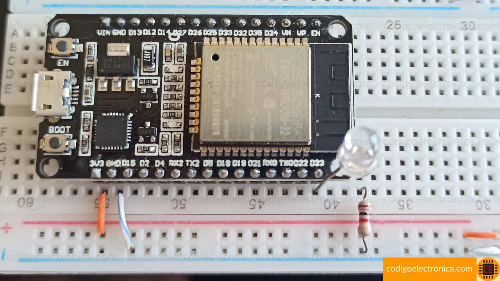

### Diseñar lógicamente el circuito con WokWi

**Wokwi** es un simulador de electrónica en línea que permite simular desarrollos sobre Arduino, ESP32 y muchas otras placas, piezas y sensores populares. Para comenzar a utilizarlo solo es necesario crear una cuenta de usuario clásica a partir de un correo electrónico personal.

Una vez creado el usuario, en el home del sitio se selecciona la placa Esp32 desde la opción *start from Scratch*:

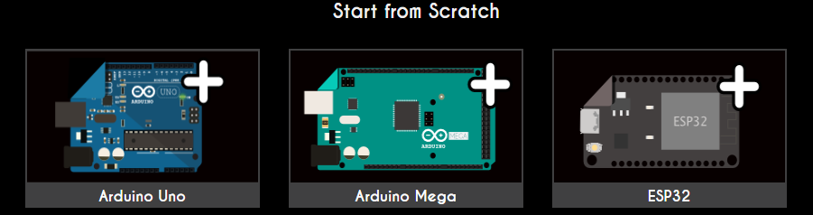

Una vez seleccionada la placa se muestra:

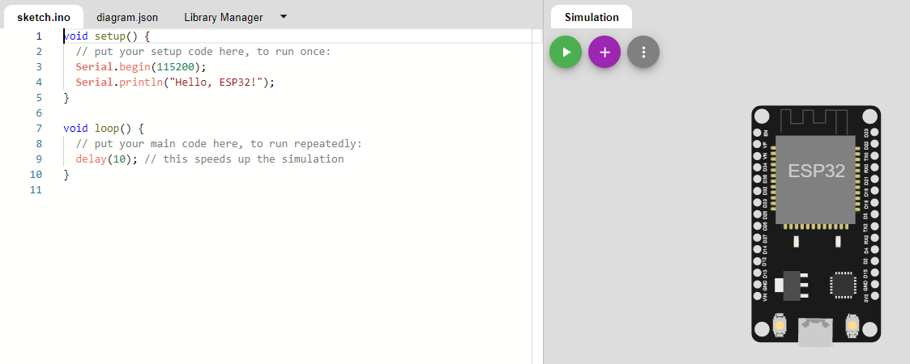

En la parte izquierda se habilita un editor para escribir las líneas de código C/C++, al igual que en Arduino IDE.
En la parte derecha se muestra gráficamente la placa y es posible incorporar mediante la opción (+) los dispositivos electronicos como leds, pulsadores, potenciometros, pantallas, etc. Luego se conectan los pines de la placa a los dispositivos agregados y la herramienta actualiza la información de conexionados mediante un archivo JSON que puede gestionarse desde la solapa *diagram.json*. Es posible definir identificadores, colores y posiciones de los elementos dibujados.

De ser necesario, la pestaña *Library Manager* permite cargar librerías específicias de desarrollo según los componentes agregados al desarrollo.

Retornando al ejemplo del **Blink**, el diagrama Wokwi resulta:

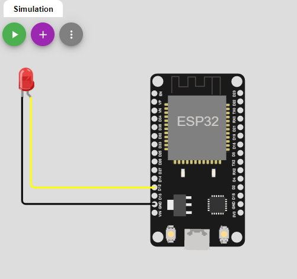

Donde el conector cátodo (-) del led se conecta a la señal **GND** del Esp32, mientras el pin **D12** se conecta con el ánodo o conector positivo (+).

Finalizado el conexionado de la placa, se escribe el código que será instalado y ejecutado. Para compilar, instalar y ejecutar el sketch en la Esp32 se selecciona la opción **Play (>)**.

Desde la opción **Guardar** es posible descargar tanto el código en formato .ino como el archivo de diagrama en formato .json con la configuración de los dispostivos y la placa.

Para ver el código de la solución acceder a esta carpeta: [Práctico 01](./sketchs/Practico%2001/)

# Programación en Arduino
## Lenguaje C/C++

* Creado por Dennis Ritchie en los laboratorios de AT&T entre 1969 y 1973
* Para escribir el SO Unix en un Lenguaje de Alto Nivel e independiente del hardware 
* Basado en el B de Ken Thompson
* En 1978 Ritchie junto a Bryan Kernigan publican el libro: “El lenguaje de programación C”
* A partir de dicho libro surge el lenguaje conocido como “el C de Kernigan y Ritchie” o simplemente “K&R C”
* A mediados de los 80 Bjarne Stroustrup crea el Lenguaje C++

> Para programar un Arduino, el lenguaje estándar es C++, aunque es posible programarlo en otros lenguajes. No es un C++ puro sino que es una adaptación que proveniente de avr-libc que provee de una librería de C de alta calidad para usar con GCC en los microcontroladores AVR de Atmel y muchas funciones específicas para los MCU AVR de Atmel.

### Fundamentos

* Lenguaje de programación estructurada + POO
* Originalmente concebido como de alto nivel, hoy de medio/bajo nivel en comparación con los lenguajes actuales
* Lenguaje Compilado, es decir que se parte del código fuente se compila en una plataforma y se obtiene un ejecutable para esa plataforma
* Manejo libre y a cargo del programador de la memoria
* Lenguaje fuertemente tipado.

### Comentarios

Dos posibilidades para definir comentarios en el código de un sketch:
* Comentario de una sola línea: //comentario...
* Comentario en más de una línea : /*...*/

### Tipo de datos

El ambiente Arduino es realmente C++, con bibliotecas de soporte, y además asume algunos parámetros relativos al microcontrolador, para simplificar el proceso de programación. C++ define una cantidad de tipos de datos distintos.

A continuación se listan tipos de datos comúnmente utilizados en el ambiente **Arduino**, con el tamaño de memoria de cada uno entre paréntesis.

* **boolean** (8 bit)- lógico simple verdadero/falso.
* **byte** (8 bit)- número sin signo entre 0 y 255.
* **char** (8 bit)- número con signo, entre -128 y 127. En algunos casos el compilador intentará interpretar este tipo de dato como un caracter, lo que puede generar resultados inesperados.
* **unsignedchar** (8 bit)- lo mismo que ‘byte’; si es que eso es lo que necesitas, deberías usar ‘byte’, para que el código sea más claro.
* **word** (16 bit)- número sin signo entre, 0 y 65535.
* **unsignedint** (16 bit)- lo mismoque ‘word’. Utiliza ‘word’ por simplicidad y brevedad.
* **int** (16 bit)- número con signo, entre -32768 y 32767. Este tipo es el más usado para variables de propósito general en Arduino, en los códigos de ejemplo que vienen con el IDE.
* **unsignedlong** (32 bit)- número sin signo entre 0 y 4294967295. Este tipo se usa comúnmente para almacenar el resultado de la función millis(), la cual retorna el tiempo que el código actual ha estado corriendo, en milisegundos.
* **long** (32 bit)- número con signo, entre -2,147,483,648 y 2,147,483,647.
* **float** (32 bit)- número con signo, entre 3.4028235E38 y 3.4028235E38. El Punto Flotante no es un tipo nativo en Arduino; el compilador debe realizar varios saltos para poder hacerlo funcionar. Evítalo siempre que te sea posible. Hablaremos de eso más tarde; En una fecha próxima se publicará un tutorial más riguroso en el uso genérico de la matemática de punto decimal en Arduino.

### Variables simples y estructuras de control

Al igual que C++ es posible definir variables simples y estructuradas; y combinarlas con estructuras  de control condicionales y repetitivas. El detalle completo de variables, operadores, funciones, punteros y estructuras de control está disponible en la [documentación de referencia de Arduino](https://www.arduino.cc/reference/en/) 

### Arreglos

Un array (**o arreglo**) es un conjunto estático de valores (todos del mismo tipo) a los que se accede con un número índice. Cualquier valor puede ser recogido haciendo uso del nombre de la variable y el número del índice. El primer valor del arreglo es el que está indicado con el índice 0, es decir el primer valor del conjunto es el de la posición 0. Un array tiene que ser declarado y opcionalmente asignados valores a cada posición antes de ser utilizado.

Tener en cuenta:
>* Para definir: **tipo_de_dato** nombre[size]; O también **tipo_de_dato** nombre[] = {val, val2,….,valn};
>* Para acceder: nombre[índice]
>* Las cadenas tienen un tratamiento especial, pero se manejan como arreglos de caracteres. Por ejemplo: char message[6] = "hello";

### Uso de funciones


#### Parámetros por Valor

> Pasar parámetros por valor o copia, las modificaciones realizadas en la función no se mantienen al terminar la misma.


#### Parámetros por referencia

> Los parámetros pasados por referencia pueden ser modificados en la función y dicha modificación sobrevive al final de la misma.
> * Se agrega operador & en la definición del prototipo de la función
int myFuncion(int &p1, int p2)
>
> * Otra manera de lograrlo es utilizar punteros:
>
>     int myFunction(int * p1, int p2)


### Constantes y funciones basicas de E/S

Para **E/S digitales**
| Función| Descripción |
| --- | --- |
|pinMode(pin, modo)|Configura el pin especificado para que se comporte como una entrada (INPUT) o una salida (OUTPUT). Adicionalmente es posible indicar INPUT_PULLUP,  INPUT_PULLDOWN para entradas con resistencias integradas PULL_UP o PULL_DOWN respectivamente|
|digitalWrite(pin, valor)|Escribe un valor HIGH o un LOW en un pin digital.|
|digitalRead(pin)|Lee el valor de un pin digital especificado, ya sea HIGH o LOW.|


Para **E/S analógicas**
| Función| Descripción |
| --- | --- |
|analogRead(pin)|Lee el valor del pin analógico especificado. Las placas Arduino contienen un convertidor analógico a digital multicanal de 10 bits. Esto significa que mapeará los voltajes de entrada entre 0 y el voltaje de funcionamiento (5 V o 3,3 V) en valores enteros entre 0 y 1023. Puntualmente en Esp32 es posible leer lecturas de 0 a 3.3V asignando un valor comprendido entre 0 y 4095.|
|analogWrite(pin,valor)|Escribe un valor analógico ( onda PWM ) en un pin. Se puede usar para encender un LED con diferentes brillos o impulsar un motor a varias velocidades.|
|analogReference()|Configura el voltaje de referencia utilizado para la entrada analógica (es decir, el valor utilizado como la parte superior del rango de entrada). En Esp32 el valor por defecto es 3.3V|


Para **comunicación Serie**
| Función| Descripción |
| --- | --- |
|Serial.begin(speed)|Establece la velocidad de datos en bits por segundo (baudios) para la transmisión de datos en serie. Para comunicarse con Serial Monitor, asegúrese de usar una de las velocidades en baudios enumeradas en el menú en la esquina inferior derecha de su pantalla. Un segundo argumento opcional configura los bits de datos (Serial.begin(speed, config)), paridad y parada. El valor predeterminado es 8 bits de datos, sin paridad, un bit de parada.|
|Serial.read()|Lee los datos seriales entrantes.|
|Serial.print(val,[format])|Imprime datos en el puerto serial como texto ASCII legible por humanos. Este comando puede tomar muchas formas. Los números se imprimen utilizando un carácter ASCII para cada dígito. Los flotantes se imprimen de manera similar como dígitos ASCII, por defecto con dos decimales. Los bytes se envían como un solo carácter. Los caracteres y las cadenas se envían tal cual.|
|Serial.println(val,[format])|Imprime datos en el puerto serie como texto ASCII legible por humanos seguido de un carácter de retorno de carro (ASCII 13 o '\r') y un carácter de nueva línea (ASCII 10 o '\n'). Este comando toma las mismas formas que Serial.print() .|
|Serial.available()|Obtiene la cantidad de bytes (caracteres) disponibles para leer desde el puerto serie. Estos son datos que ya llegaron y se almacenaron en el búfer de recepción en serie (que contiene 64 bytes).|

**Constantes** más usadas:
| Constantes| Descripción |
| --- | --- |
|INPUT/OUTPUT|Permite definir entradas o salidas mendiante la función pinMode().|
|HIGH (5V)/LOW (0V)| Permiten indicar un valor Alto o Bajo de tensión dependiendo la configuración del pin.|
|LED_BUILTIN|La mayoría de las placas Arduino tienen un pin conectado a un LED integrado en serie con una resistencia. La constante LED_BUILTIN es el número del pin al que está conectado el LED integrado. La mayoría de las placas tienen este LED conectado al pin digital 13. Para el caso de los Esp32 este valor corresponde a 2| 


## Puertos de Comunicaciones

Para que dos dispositivos se comuniquen, sean computadoras, 
microcontroladores, etc, se necesita un método (protocolo) de 
comunicación acordado de antemano. La comunicación serie es una de las formas más comunes de comunicación entre dispositivos digitales.

Para que puedan comunicarse, dos dispositivos tienen que acordar
ciertas cosas.
-  La velocidad a la cual los datos serán enviados y leídos.
-  Los niveles de voltaje representando a un 1 y a un 0.
La mayoría de los procesadores vienen equipados con una o más
UART. (Universal Asynchronous Receiver-Transmitters)


### Comunicación Serial

Los puertos serie son la forma principal de comunicar una placa Arduino con un ordenador. Gracias al puerto serie podemos, por ejemplo, mover el ratón o simular la escritura de un usuario en el teclado, enviar correos con alertas, controlar un robot realizando los cálculos en el ordenador, encender o apagar un dispositivo desde una página Web a través de Internet, o desde una aplicación móvil a través de Bluetooth.

Existen un sin fin de posibilidades en las que se requiere el empleo del puerto serie. Por tanto el puerto serie es un componente fundamental de una gran cantidad de proyectos de Arduino, y es uno de los elementos básicos que debemos aprender para poder sacar todo el potencial de Arduino.

En esta entrada aprenderemos el funcionamiento básico de los puertos serie en Arduino. Al final de la entrada se adjuntan varios códigos de ejemplo, pero antes conviene explicar brevemente algo de teoría sobre qué es un puerto serie, y algunos términos que necesitaremos para entender correctamente el funcionamiento del puerto serie.

#### ¿Qué es el puerto serie?
Un puerto es el nombre genérico con que denominamos a los interfaces, físicos o virtuales, que permiten la comunicación entre dos ordenadores o dispositivos.

Un puerto serie envía la información mediante una secuencia de bits. Para ello se necesitan al menos dos conectores para realizar la comunicación de datos, RX (recepción) y TX (transmisión). No obstante, pueden existir otros conductores para referencia de tensión, sincronismo de reloj, etc.

Por el contrario, un puerto paralelo envía la información mediante múltiples canales de forma simultánea. Para ello necesita un número superior de conductores de comunicación, que varían en función del tipo de puerto. Igualmente existe la posibilidad de conductores adicionales además de los de comunicación.

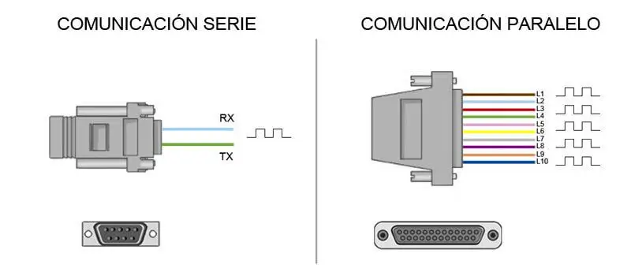

Históricamente ambos tipos de puertos han convivido en los ordenadores, empleándose los puertos paralelos en aquellas aplicaciones que requerían la transmisión de mayores volúmenes de datos. Sin embargo, a medida que los procesadores se hicieron más rápidos los puertos de serie fueron desplazando progresivamente a los puertos paralelos en la mayoría de aplicaciones.

Un ordenador convencional dispone de varios puertos de serie. Los más conocidos son el popular USB (Universal Serial Port) y el ya casi olvidado RS-232 (el de los antiguos ratones). Sin embargo, dentro del ámbito de la informática y automatización existen una gran cantidad adicional de tipos de puertos serie, como por ejemplo el RS-485, **I2C**, SPI, entre otros.

En ocasiones se refiere a los puertos serie como UART. La **UART** (universally asynchronous receiver/transmitter) es una unidad que incorporan ciertos procesadores, encargada de realizar la conversión de los datos a una secuencia de bits y transmitirlos o recibirlos a una velocidad determinada.


### Ejercitación

> **Caso práctico 02**: desarrollar un sketch que permita encender/apagar un juego de LEDs (uno azul y otro verde) utilizando para ello el puerto serie. La idea es utilizar los dos leds que ya vienen provistos en la placa UTN (uno verde más el led propio de la Esp32) y procesar las siguientes entradas por puerto serie:
> - **v** o **V** para encender el LED verde y apagar el azul
> - **a** o **A** para encender el LED azul y apagar el verde
> 
Para ver el código de la solución acceder a esta carpeta: [Práctico 02](./sketchs/Practico%2002/)

> **Caso práctico 03**: desarrollar un sketch que permita >procesar un comando (en formato texto) recibido por el puerto >serie tal que:
> "LUZ_ON": encienda el LED y active un relay (que podría estar > conectado con el sistema de ilumninación de una habitación).
> "LUZ_OFF": con apague el LED y desactive el relay.

Para ver el código de la solución acceder a esta carpeta: [Práctico 03](./sketchs/Practico%2003/)

### Comunicación I2C

El bus de comunicaciones I2C (nombrado a veces como **I cuadrado C**, I^2) es un protocolo que se efectúa por medio de DOS hilos. A través de estos dos hilos pueden conectarse diferentes dispositivos donde algunos de ellos serán **MAESTROS** en cuanto muchos otros dispositivos serán **ESCLAVOS**.

Para poder reconocer cada uno de los dispositivos conectados a los DOS hilos del bus I2C, a cada dispositivo se le asigna una dirección. La dirección de I²C estándar es el primer byte enviado por el maestro, aunque los primeros 7 bits representan la dirección y el octavo bit (R/W-Bit) es el que comunica al esclavo si debe recibir datos del maestro o enviar 
datos al maestro. Cada uno de los circuitos integrados con capacidad de soportar un I²C tiene una dirección predeterminada por el fabricante (!).

Este tipo de comunicaciones el **MAESTRO** es el que tiene la iniciativa en la transferencia y este es quien decide con quien se quiere conectar para enviar y recibir datos y también decide cuando finalizar la comunicación.

Los DOS hilos del BUS interfaz de comunicación I2C PIC son lineas de colector abierto donde una de las lineas lleva la señal de reloj y es conocida como (**SCL**), y la otra linea lleva los datos y es conocida como (**SDA**).

La conexión I2C entre un maestro y vários esclavos se muestra a continuación:

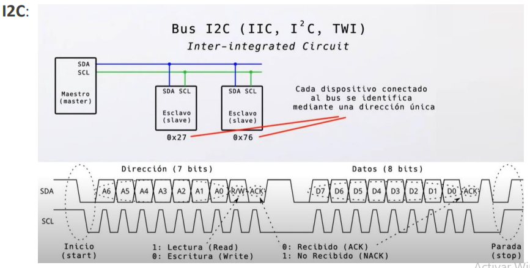

I2C se utiliza con frencuencia par conectar periféricos de menor velocidad a la placa. Uno de estos periféricos suelen ser las pantallas o módulos LCD. La placa de desarrollo UTN viene integrada con una pantalla OLED para arduino con las conexiones de pines ya configuradas.

Para conocer qué es y comó funciona en detalle este protocolo, tal como se muestra en el video de este link: [I2C explicado](https://www.youtube.com/watch?v=kuLgPLrg-cY).

> **Caso práctico 04**: refactorizar el sketch del práctico anterior para mostrar en el módulo OLED el estado de los componentes gestionados por el puerto serie. 
>
>**Nota**: para poder utilizar este módulo es necesario importar la librería **Adafriut SH110X**.

Para ver el código de la solución acceder a esta carpeta: [Práctico 04](./sketchs/Practico%2004/)

### Comunicación SPI:
El bus **SPI** (del inglés Serial Peripheral Interface) es un estándar de comunicaciones, usado principalmente para la transferencia de información entre circuitos integrados en equipos electrónicos.  Es un estándar para controlar casi cualquier dispositivo electrónico digital que acepte un flujo de bits serie regulado por un 
reloj (comunicación sincrónica).

La sincronización y la transmisión de datos se realiza por medio de 4 señales:
- **CLK** (Clock): Es el pulso que marca la sincronización. Con cada pulso de este reloj, se 
lee o se envía un bit. También llamado TAKT (en alemán).
-  **MOSI** (Master Output Slave Input): Salida de datos del Master y entrada de datos al 
Slave. También llamada SIMO.
- **MISO** (Master Input Slave Output): Salida de datos del Slave y entrada al Master. 
También conocida por SOMI.
- **SS/Select:** Para seleccionar un Slave, o para que el Master le diga al Slave que se 
active. También llamada SSTE. Una conexión SS por dispositivo

La conexión SPI entre un maestro y vários esclavos se muestra a continuación:

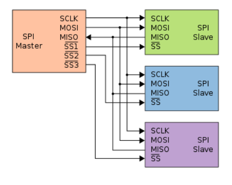

## Sensores integrados
### Usando potenciómetro, sensor DHT22 y encoder.
La placa de desarrollo UTN viene integrada con un sensor DHT22 que permite monitorear temperatura y humedad relativa de forma precisa y sencilla a un bajo precio. La salida suministrada es de tipo digital, no requiriéndose utilizar entradas analógicas. Dicho valor se lee mediante el **pin 33**. 
Por su parte el potenciómetro está integrado como entrada analógica en el **pin 32**.

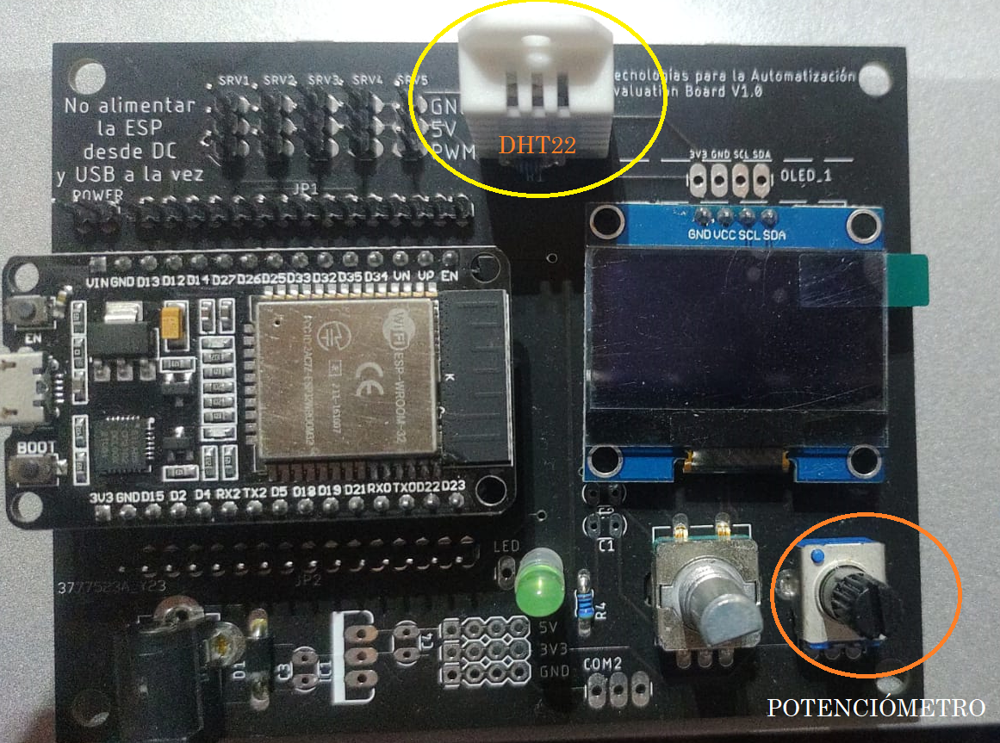

> **Caso práctico 05**: desarrollar un sketch para regular la intensidad del LED verde utilizando como entrada los valores obtenidos del potenciómetro (o divisor de voltaje). Los valores deberán ser visualizados en el módulo OLED utilizado en la práctica anterior, indicando valor de lectura y voltage resultante (valor comprendido entre[0;3.3]v) que será enviado como salida al led.

Para ver el código de la solución acceder a esta carpeta: [Práctico 05](./sketchs/Practico%2005/)

> **Caso práctico 06**: desarrollar un sketch que permita leer los valores de Humedad y Temperatura relativas mediante el sensor DTH22 integrado. En todo momento los valores deben ser visualizados en el módulo OLED. En caso de los valores de temperatura leídos por el sensor superen los 20 °C, se deberá encender el led verde, cuando no llegue a ese valor de lectura deberá apagarse automáticamente.

Para ver el código de la solución acceder a esta carpeta: [Práctico 06](./sketchs/Practico%2006/)

> **Caso práctico 07**: desarrollar un sketch que permita mostrar por el diplay los pasos decrecientes (en sentido horario) o decrecientes (en sentido contrario) leidos desde el encoder. En caso de presionar el botón se deberá encender/apagar la luz led respectivamente.
Se deberán mostrar los datos:
- Pasos
- Sentido de giro: RELOJ/NO-RELOJ
- Estado LED: ON/OFF

Para ver el código de la solución acceder a esta carpeta: [Práctico 07](./sketchs/Practico%2007/)

# Conexión a Internet


## Conexión Wifi
### Introducción

Es muy normal el poseer dispositivos que pueden conectarse a Internet, como lo es un teléfono móvil, una laptop, una televisión, etc. Hay muchos casos en los cuales, se necesita hacer el envío de información hacia alguna plataforma alojada en la Nube. Lo necesario para realizar esto es conectarse a **Internet**. 

En esta sección se realizará la conexión de la tarjeta ESP32 hacia una red WiFi aprovechando que nativamente el chip cuenta con conectividad WiFi. Esta última es compatible con 802.11 b/g/n en la banda de los 2.4GHz, alcanzando velocidades de hasta 150 Mbits/s. También incluye comunicación Bluetooth compatible con Bluetooth v4.2 y Bluetooth Low Energy (BLE) que serán mencionados a posterior.

### Configurar una conexión Wifi

Para conectar la tarjeta Esp32 a una red inalámbrica es necesario conocer como mínimo los siguientes datos:
- **SSID**: es el nombre público que identifica una red local inalámbrica, es decir, una WLAN. Son las siglas de Service Set Identifier.
- **PASSWORD**: Clave de seguridad de la red.

Estos datos pasan a ser constantes del sketch cuyos valores dependerán de la red a la que se conecta la placa. A continuación se muestra el código necesario:
>
>``` c++
>#include <WiFi.h>
>
>const char* SSID = "UNA_RED";
>const char* PASS = "UN_PASS";
>
>void setup() {
>    Serial.begin(9600);
>    Serial.println("");
>    WiFi.begin(SSID, PASS);
>    while (WiFi.status() != WL_CONNECTED) {
>        delay(500);
>        Serial.print(".");
>    }
>    Serial.println("");
>    Serial.println("WiFi conectado");
>    Serial.println(WiFi.localIP());
>    server.begin();  // iniciamos el servidor
>}
>```

El funcionamiento del código anterior se explica a continuación:

Como primer paso, se debe llamar a la librería WiFi.h, que se encuentra instalada en el IDE de Arduino por defecto (No es necesario instalar).

>``` c++
>#include <WiFi.h>
>```
Ahora, se definen como char constante el nombre y la contraseña de la red WiFi a la cual se realiza la conexión.

>```c++
>const char* SSID = "UNA_RED";
>const char* PASS = "UN_PASS";
>```

Se define en la función **setup()** el inicio del terminal Serial a una velocidad de baudios determinada, y se inicia la conexión WiFi con el comando **WiFi.begin()**, añadiendo los nombres de las variables mencionadas (SSID y PASS). Adicionalmente se añade un retardo de 2 segundos.

>```c++
>void setup() {
>  /*Iniciamos el terminal Serial para la escritura de >algunos parámetros */
>  Serial.begin(9600);
>  /*Iniciamos la conexión a la red WiFi definida*/
>  WiFi.begin(SSID, PASS);
>  delay(2000);
>```

Se añade un ciclo While que tiene como función imprimir puntos (“.”) mientras se realice la conexión con la red WiFi. Una vez conectado, dejarán de aparecer esos caracteres.

>```c++
>  Serial.print("Se está conectando a la red WiFi denominada ");
>  Serial.println(ssid);
>  while (WiFi.status() != WL_CONNECTED) {
>        delay(500);
>        Serial.print(".");
>    }
>```    
Cuando la conexión se haya realizado, se imprimirá en el monitor Serial “WiFi Connected”, junto a la dirección IP que se le asignó al ESP32. Cabe mencionar que no se contempla el uso de Loop () debido a que, la conexión se realiza una única vez, por lo que no es necesario realizar un bucle infinito de conexiones.

>``` c++    
>Serial.println("");
>Serial.println("WiFi connected");
>Serial.println("IP address: ");
>Serial.println(WiFi.localIP());
>```    

## Servidor Web con Esp32

### Introducción

Un servidor web con ESP32, ¿es posible alojar un servidor Web en la tarjeta?, ¿para qué?. La respuesta es sencilla: para poder acceder de manera remota a la placa mediante el protocolo de comunicación HTTP sin necesidad de tener hardware especializado. Esto permite tener el control remoto de la Esp32 desde cualquier punto de la red desde el que se tenga acceso. Esto último implica dos cosas: 
- tanto el cliente Web como el esp32 estan en la misma red (se accede directo por IP local asignada a la placa)
- la tarjeta tiene asignada una IP fija y el cliente accede desde cualquier punto por Internet.
Para más información consultar este [link](https://es.wikipedia.org/wiki/Direcci%C3%B3n_IP).


### ¿Cómo funciona un Servidor Web? 

Un servidor Web es un proceso dedicado capaz de responder  mensajes mediante el protocolo HTTP enviados desde un cliente. Típicamente los clientes Web más usados son los navegadores Web como Google Chrome, Firefox, etc.

Comunmente cuando se escribe la **URL** (cadena que identifica unívocamente a un recurso del servidor) desde un navegador lo que este hace es enviar una solicitud HTTP al servidor WEB (mediante un método específico del protocolo llamado **GET**). El trabajo se traslada al servidor WEB que debe de poder procesar esa solicitud.

Por ejemplo, si se escribe una URL como **http://192.168.1.125/ledon** en el navegador de un PC o móvil,  el navegador envía una solicitud HTTP al ESP32 (identificado como un nodo más de la red) para que procese esta solicitud, encendia un LED y devuelva como respuesta una página web (contenido HTML) al navegador mostrándole el estado del LED: ON.

### Modos de funcionamiento

El ESP32 con la librería Wifi.h nos posibilita trabajar de varias maneras diferentes. No solo la típica conexión al AP (punto de acceso) de tu router (como cualquier PC o móvil), sino que también permite una conexión directa entre ESP32 y los clientes sin pasar por el router, ni por su punto de acceso Wifi.

- **Modo Estación (STA)**: su comportamiento que como cualquier otro dispuesto en vuestra casa, móvil, PC o tablet.
- **Modo de Punto de acceso (AP)**: en este modo de operar, el ESP32 crea su propia red Wifi, permitiendo conexiones máquina a máquina, estableciendo una comunicación directa entre dos o más estaciones (PC, móvil, Tablets) sin un punto de acceso que enrute el tráfico.
- Existe un tercer modo que es un modo mixto, es decir, es un híbrido que se comporta de los dos modos anteriores.

Cualquiera de estos modos de operar son posibles con ESP32, la diferencia radica en decidir como se quiere que se comporte el ESP32. 

### Primer servidor Web

Para un primer ejemplo se creará un servidor web independiente con un ESP32 que controla las salidas (dos LED) mediante el entorno de programación Arduino IDE. El servidor web responde a dispositivos móviles y se puede acceder a él con cualquier dispositivo que funcione como navegador en la red local. Se mostrará cómo crear el servidor web y cómo funciona el código paso a paso.

#### Circuito del proyecto

Se conectan dos LED al ESP32 como se muestra en el siguiente diagrama esquemático: un LED conectado a **GPIO 26**, y el otro para **GPIO 27**.

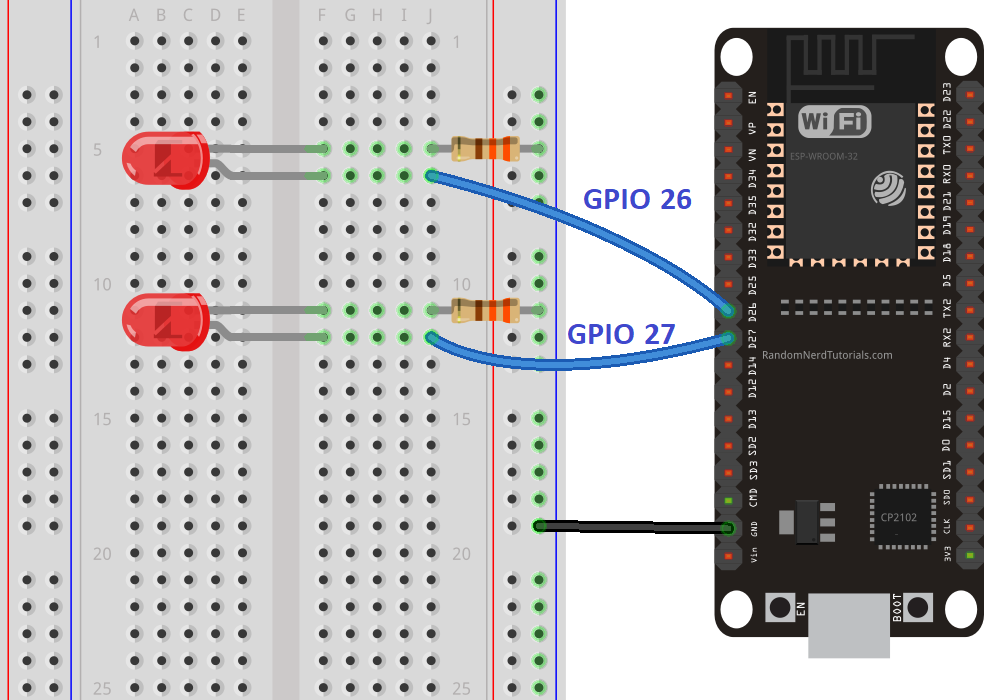 

#### Código en Arduino IDE

El código de este primer servidor esta [Práctico 08](./sketchs/Practico%2008/).

Para que el código anterior funcione es necesario obtener el SSID y clave de la red local a la se va a conectar tanto el Esp32 como el movil o pc desde donde se quiera hacer la prueba. Luego de definir dichos valores como constantes en el sketch es necesario subir el código a la placa y obtener desde el Monitor Serial la dirección IP asignada a la tarjeta (tal como se muestra a modo de ejemplo en la siguiente imagen).

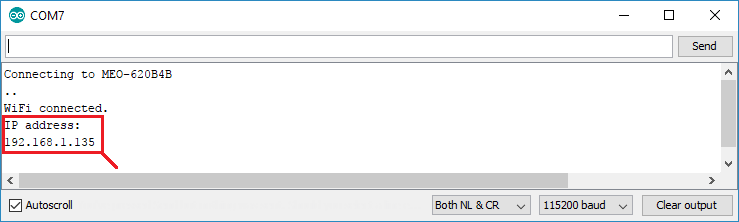 


### Consideraciones de funcionamiento:
> 
> Una vez definidos los valores de las constantes SSID y PASS >lo siguiente es crear un servidor en un puerto determinado por >ejemplo puerto 80 mediante la línea:

``` c++
WiFiServer server(80);
```

> Luego se programa qué hacer cuando un nuevo cliente establece una conexión con el servidor web, tal como se muestra en la línea:

``` c++
WiFiClient client = server.available();
if(client){
    //....
}
```
> El loop seguirá ejecutandose validando que la variable **client** no sea nula, en tal caso entiende que tiene un nuevo cliente que atender y comienza un nuevo ciclo mientras el cliente se encuentre conectado.

> Lo que sigue a continuación es el procesamiento típico de una solicitud HTTP: se lee byte a byte el header o cabecera de la solicitud hasta que se encuentra con un salto de línea o '\n'.En el header se encontrará tícamente con el método HTTP utilizado por el cliente (GET/POST) seguido de la URL que identifica el recurso solicitado. Con esta información es posible definir las acciones a tomar en función del estado de la placa.

> Por último se crea una cadena con el código HTML que será enviado al cliente como respuesta HTTP. Notar que el código incluye una sentencia break para salir del ciclo while() utilizado para el procesamiento de la petición.


## Ejercitación

> Caso práctico 09:
> * Tomando el skectch del caso práctico 03, refactorizar su código para crear un servidor Web que permita encender el relay de manera remota utilizando la conexión WIFI a la red local, y dejar sin efecto el encendio mediante los comandos recibidos por el puerto serie. Para ver el código de la solución acceder a esta carpeta: [Práctico 09](sketchs/Practico%2003/)

> Caso práctico 10:
> * Tomando el skectch del caso anterior, refactorizar su código para procesar mensajes recibidos desde un bot de Telegram. Deberá investigar cómo crear un bot y mediante su TOKEN ACCESS gestionar las comunicaciones con la placa de desarrollo. Librería sugerida: UniversalTelegramBot.
Para ver el código de la solución acceder a esta carpeta: [Práctico 10](./sketchs/Practico%2010/)


# Plataformas IoT 

### Introducción
Una plataforma de IoT es una parte integral de cualquier servicio basado en el Internet de las Cosas. Puede ayudarte a acelerar el tiempo de comercialización, minimizar el riesgo, reducir el costo de desarrollo y ayudarte a llegar más rápido al mercado de los productos.

### ¿Qué es una plataforma de IoT?
Una plataforma de Internet de las cosas es un grupo de tecnologías que proporcionan los bloques de construcción para desarrollar un producto IoT. Las plataformas de IoT proveen la "infraestructura" que se usa para crear las características específicas de una solución.

Al asumir la funcionalidad no diferenciada, las plataformas de IoT ayudan a reducir el riesgo y el costo de desarrollo y a acelerar el tiempo de comercialización de un producto.

Cuando se habla de plataformas IoT, a menudo se lanza a la jerga técnica como protocolos de transporte, motores de reglas, repositorios de datos, etc. Si bien esas consideraciones son importantes y merecen una planificación cuidadosa, no ilustran claramente cómo una plataforma de IoT puede ayudar en el desarrollo de un producto IoT.

### Funcionalidades clave

Las tareas clave de una plataforma IoT son:

- Adquirir datos del mundo real a través de sensores
- Analizar los datos localmente (edge computing)
- Conectarse a la nube para transmitir datos y recibir órdenes
- Almacenar los datos en la nube
- Analizar los datos en la nube para crear una visión
- Ordenar a las "cosas" que realicen tareas específicas basadas en la comprensión
- Presentar las ideas a los usuarios
 
 Adicionalmente debería proporcionar servicios para:

- Realizar todas las operaciones de forma segura a través de la pila de tecnología IoT
- Identificar y gestionar todos sus dispositivos de IoT a escala

## Plataforma Cloud IOT
Esta categoría de plataformas IoT proporciona los elementos básicos para su producto, incluyendo el consumo, el transporte, el almacenamiento, el análisis y la visualización de datos. Como su nombre lo indica, su objetivo es permitir el rápido desarrollo de su aplicación abstrayendo las complejidades de la construcción de una solución IoT.

Hay cientos de plataformas de Internet de las cosas en el mercado, por lo que puede ser desalentador averiguar cuál de ellas utilizar. Las plataformas de habilitación de aplicaciones incluyen:

- Plataformas industriales
- Plataformas de consumo
- Plataformas dirigidas a los desarrolladores
- Plataformas de alto nivel (arrastrar y soltar), buenas para la - creación de prototipos o MVPs
- Plataformas que se centran en verticales específicas
- Plataformas en el lugar vs. Edge vs. Cloud

Algunos de los principales actores en el espacio de las plataformas cloud IoT incluyen:

- Microsoft Azure IoT
- AWS IoT
- Google Cloud IoT Core
- ThingSpeak
- Arduino IoT Cloud

### ThingSpeak

ThingSpeak es una plataforma abierta de aplicaciones, diseñada para permitir conectar personas con objetos. Se caracteriza por ser una plataforma Open Source  con una API para almacenar y recuperar datos de los objetos usando el protocolo HTTP sobre Internet o vía LAN (Local Area Network).

Se trata de una plataforma basada en Ruby on Rails 3.0 (RoR), este es un framework de aplicaciones web  de código abierto basado en Ruby, cuya arquitectura está basada en el Modelo Vista Controlador (MVC). Se caracteriza por su simplicidad a la hora de programar aplicaciones del mundo real, escribiendo menos código y con una configuración mucho más sencilla que otros frameworks. Otra de las características que hacen de RoR un framework perfecto para el desarrollo de aplicaciones es que permite el uso de meta programación, haciendo que su sintaxis sea más legible y llegue a un gran número de usuarios.

#### Características principales
Algunas características importantes de esta plataforma son:
- Dispone de una **API** de programación abierta. Un punto importante a la hora de desarrollar cualquier proyecto es encontrar un API disponible de forma sencilla para que el desarrollador tenga los mecanismos necesarios para el desarrollo de la aplicación. En este caso, ThigSpeak dispone de una API la cual está disponible en GitHub para su descarga en un servidor propio. Es totalmente abierta, por lo que también se puede modificar su código fuente original y así contribuir a la comunidad con nuevas características, un principio básico en toda
plataforma Open Source.

- **Plugins**: para extender la funcionalidad del sitio también se nos brinda la oportunidad de desarrollar plugins. Estos nos ofrecen la posibilidad de crear aplicaciones de forma nativa en nuestra plataforma ThigSpeak.  Soporta HTML, CSS y JavaScript como lenguajes de programación. Al igual que los canales los plugins pueden ser público o privados según sean nuestras necesidades.
- **Integración**: Uno de los puntos fuertes en cualquier plataforma IoT, es que permita una amplia integración con diversos dispositivos Hardware y software. En este caso ThingSpeak permite la integración de su plataforma con: Arduino/ Raspberry Pi/Móbiles/Aplicaciones web/Redes Sociales o Análisis de datos con MATLAB 

- Otra característica es que dispone de un conjunto de apps para conectar con redes sociales, soportar comunicación con Web Services, calendarizar tareas o incluso definir reglas que disparen acciones ante ciertos valores de datos recibidos en un canal.

#### Chanels

Los canales almacenan todos los datos que recopila una aplicación ThingSpeak. Cada canal incluye ocho campos que pueden contener cualquier tipo de datos, más tres campos para datos de ubicación y uno para datos de estado. Una vez que recopila datos en un canal, se utilizan las aplicaciones de ThingSpeak para analizarlos y visualizarlos.

Para crear canales es necesario contar primero con una cuenta en la plataforma. Una vez creado el usuario a partir de una mail validado, es posible crear canales para los proyectos.


#### Proyecto de aplicación

Para un primer proyecto de aplicación se propone generar un conjunto de valores aleatorios (con valores comprendidos entre 1 y 100) desde la placa Esp32 que podemos pensar en datos recolectados de un **sensor X** con un propósito específico y enviarlos a la plataforma para su visualización en tiempo real sobre un dashboard que grafique los valores enviados desde la placa.

Lo primero es crear un canal llamado **Random IoT Values** con un solo campo llamado **sensor**. Una vez confirmados los datos del canal, de la pestaña de **API Key** copiar los valores de: Channel ID y Write API Key. Dichos valores serán utilizados en el sketch de Arduino IDE para inicializar la librería de la plataforma. 

El código del proyecto se encuentra en [Práctico 11](./sketchs/Practico%2011/)


## Ejercitación 

Caso Práctico 12:
Diseñar una estación meteorológica desarrollada a partir de una placa ESP32 y un sensor DHT22. La información recolectada por el sensor es enviada a un servidor de ThingSpeak mediante Wifi. 

El código del proyecto se encuentra en [Práctico 12](./sketchs/Practico%2011/)


## Plataforma Arduino Cloud

IoT Arduino Cloud es una plataforma en la nube que permite, al igual que ThingSpeak, conectar y gestionar dispositivos Arduino de forma remota. Puedes crear proyectos de IoT, controlar sensores y actuadores, y visualizar los datos en un panel de control en línea. 
La solución no es gratuita pero creando una cuenta a partir de un correo personal es posible acceder a una gratuita con las limitaciones propias de toda versión free. Actualmente soporta una gran familia de controladores Arduino, incluida la placa Esp32.

### Paso a Paso con Arduino Cloud

#### Paso 1: Registro y Acceso

Lo primero es ingresar al sitio web de [IoT Arduino Cloud](https://iot.arduino.cc) y crear una cuenta. Para ello solo es necesario ingresar los datos de un correo electrónico mediante el cual se confirma la creación de la cuenta. También es posible hacer un **sigin** mediante una cuenta asociada de Google.
Luego se inicia sesión en la cuenta de IoT Arduino Cloud con las credenciales proporcionadas.

#### Paso 2: Crear un Nuevo Dispositivo

Después de iniciar sesión, se ingresa al panel de control y se selecciona la solapa **Dispositivos**. Tener presente que para la plataforma el término dispositivo hace referencia específicamente a los microntroladores.
Mediante la opción "ADD" se permite configurar un nuevo dispositivo. Tener en cuenta que la placa Esp32 corresponde a un dispositvo de tercero por lo que deberá seleccionar la opción **Third party device**. Se debe asignar un nombre único al dispositivo y seleccionar el modelo específico de placa (La placa UTN corresponde con la opción **ESP32 Dev Module**).
Lo más importante de este paso es recordar el ID y la clave de autenticación que se genera. Éstas credenciales se utilizarán para conectar desde el dispositivo físico a la plataforma IoT. Siempre se aconseja descargar estos valores del documento pdf que genera automáticamente.


**Paso 3: Arduino IDE para IoT Arduino Cloud**

> Desde Arduino IDE (local)

Se debe instalar la biblioteca Arduino IoT Cloud siguiendo estos pasos:
a. Desde  "Herramientas" > "Gestor de tarjetas".
b. Buscar "Arduino IoT Cloud" y seleccionar la opción "Instalar".
Abre un nuevo proyecto en el Arduino IDE y selecciona la placa Arduino que estás utilizando.
Ve a "Programar" > "Incluir Biblioteca" > "Arduino IoT Cloud" y selecciona tu dispositivo en "Dispositivo Arduino".
Pega la clave de autenticación que copiaste en el paso 2 en el código Arduino.

> Desde el IDE remoto

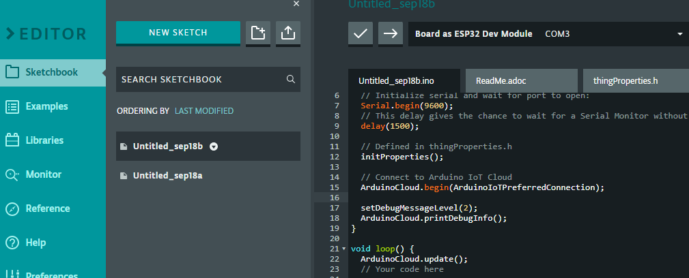

Adicionalmente es posible trabajar directamente desde el sitio ingresando en la opción **sketch**. Actualmente la plataforma tiene una vista de desarrollo completa muy similar al entorno Arduino IDE de escritorio pero para poder utilizarlo correctamente es necesario instalar un pluggin que la propia plataforma sugiere descargar cuando se selecciona esta vista de desarrollo. Algo interesante es notar que el proyecto que genera la plataforma ya se encuentra divido en varios archivos incluidos un archivo de configuración y una librería propia para la declaración y variables y funciones auxiliares.

#### Paso 4: Crear un Think (Lógica de Control)

Desde el panel de control la opción **Thinks** permite crear** las cosas**. Tener presente que este término está vinculado con actuadores y sensores.
Desde la opción "ADD" se crea y se asigna un nombre al nuevo objeto. Si el plan es free solo permite crear dos things como máximo. 
Luego se configuran las reglas y acciones que se necesita que realice el dispositivo vinculado. Por ejemplo, se puede crear un think que encienda un LED cuando la temperatura supere cierto umbral. 

Un concepto interesante en este paso es de **variables**. Las variables son las herramientas con las que es posible monitorear o controlar el thing desde el **dashboard**. Por ejemplo una variable de tipo bool que tome el valor desde un switch dibujado en el panel de control diseñado.

#### Paso 5: Crear un Dashboard

Para poder interactuar con los things creados en el paso anterior es necesario diseñar un panel (o dashboard). Un dashboard se personaliza mediante widgets como gráficos, botones (switch) o medidores que permiten mostrar los datos de los dispositivos y controlarlos. Luego se Asocian los things que se crearon en el paso 4 a los widgets del dashboard para controlar y mostrar los datos en tiempo real.

#### Paso 6: Conectar y Monitorear tu Dispositivo

Por último se sube el código Arduino al dispositivo siguiendo las instrucciones habituales del Arduino IDE.
Una vez que el dispositivo está en línea, se podrá monitorear y controlar su funcionamiento desde el dashboard que se creó en el paso 5.

También es posible utilizar una app para dispositivos móviles que puede desacargase de las tiendas habituales. Mediante estas app se trabaja con los dashboard diseñado de la misma manera que se haría desde el entorno de trabajo ofrecio por el sitio Web de la plataforma.

Para más detalle se sugiere el siguiente [video](https://www.youtube.com/watch?v=ybZDmEITIyE).


## Ejercitación 

Caso Práctico 13:
Se sugiere diseñar la misma estación meteorológica desarrollada mediante ThingSpeak pero esta vez usando Arduino Cloud. 