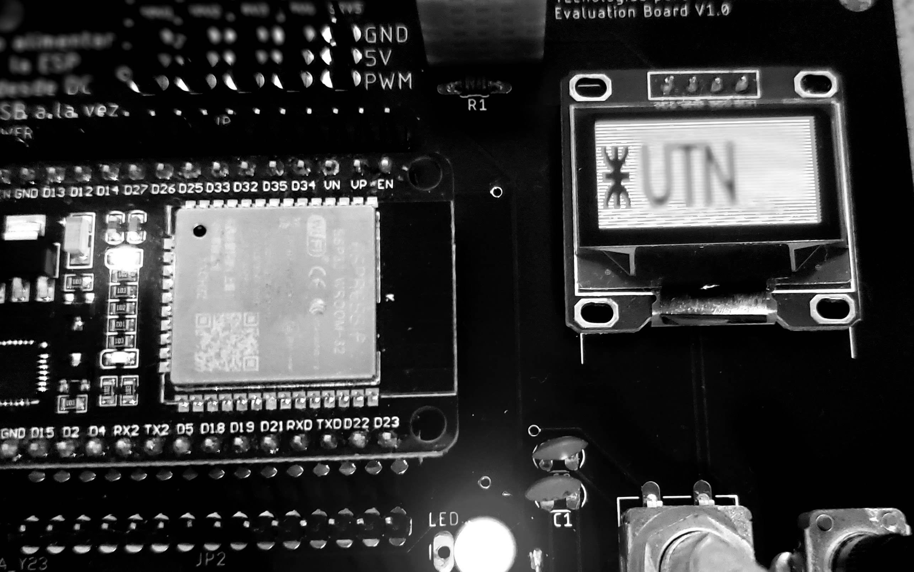

# Tecnologías para la Automatización

¡Bienvenido al repositorio de la asignatura "Tecnologías para la Automatización"! En este espacio encontrarás recursos, materiales y ejemplos relacionados con: **Robótica**, el **Internet de las Cosas** (IoT) y los **Sistemas de control**. Esta asignatura te proporcionará los conocimientos y las habilidades necesarias para comprender y aplicar estas tecnologías en el campo de la automatización. Cabe destacar que si bien éstos ejes temáticos serán abordados con cierto grado de detalle, es nuestro objetivo brindar los conceptos introductorios ya que cada eje en sí mismo es una área de conocimiento

## Acerca de la Asignatura

En esta asignatura, exploraremos los siguientes ejes temáticos principales:

1. **Sistemas de Control**: Comprenderás conceptos de Control para Robótica, Sistemas a lazo abierto y
lazo cerrado, compensación y conceptos de estabilidad absoluta y relativa.

2. **Robótica**: Aprenderás los fundamentos de la robótica, incluyendo la cinemática, la dinámica y la programación de robots. Exploraremos diferentes tipos de robots, sus aplicaciones y cómo diseñar soluciones robóticas modelo.

3. **Internet de las Cosas (IoT)**: Te sumergirás en el mundo de los dispositivos interconectados. Aprenderás cómo los sensores, actuadores y sistemas embebidos pueden comunicarse entre sí y con la nube para recopilar datos, tomar decisiones y controlar procesos de manera eficiente.

El detalle completo de contenidos se encuentra en la siguiente [Modalidad Académica.](./assets/2023%20-%20TOC%20-%20Planificación%20de%20Tecnologías%20para%20la%20Automatización.pdf)

## Contenido del Repositorio

El repositorio se estructura de la siguiente manera:

- **Lecturas**: Encontrarás documentos y enlaces a recursos en línea que complementan las clases. Estos materiales proporcionarán una comprensión más profunda de los conceptos presentados en el aula.

- **Proyectos**: Aquí podrás acceder a proyectos prácticos relacionados con cada uno de los ejes temáticos. Los proyectos te permitirán aplicar los conocimientos teóricos en situaciones del mundo real, fomentando así tu capacidad para resolver problemas y tomar decisiones informadas.

- **Ejemplos de Código**: Esta sección contiene ejemplos de código en diferentes lenguajes de programación utilizados en la automatización. Estos ejemplos te ayudarán a familiarizarte con la implementación práctica de soluciones en robótica y IoT.

- **Recursos Adicionales**: Enlaces a libros, videos y otros recursos útiles para ampliar tu comprensión en cada uno de los ejes temáticos.

## Ejes temáticos

- [Introducción a los Sistemas de Control](./Control/README.md)
- [Internet de las Cosas](./IoT/README.md)
- [Robótica](./Robótica/README.md)